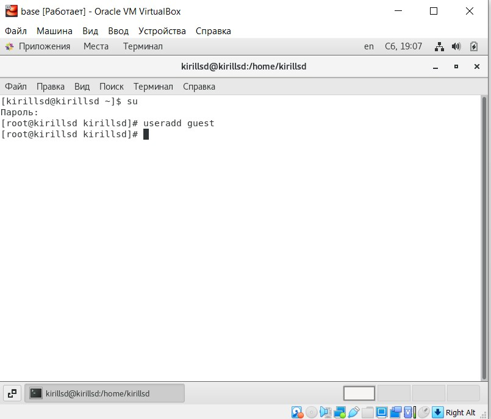
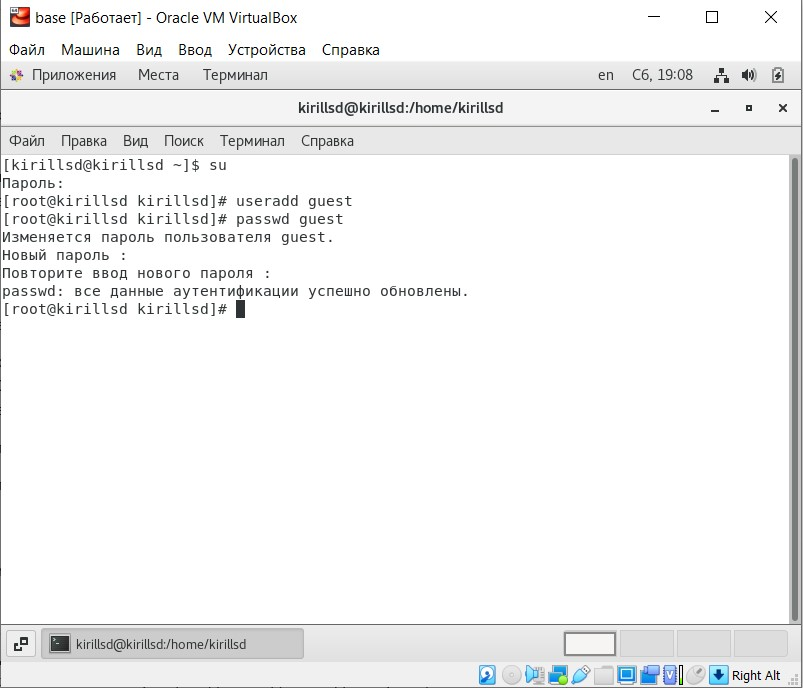
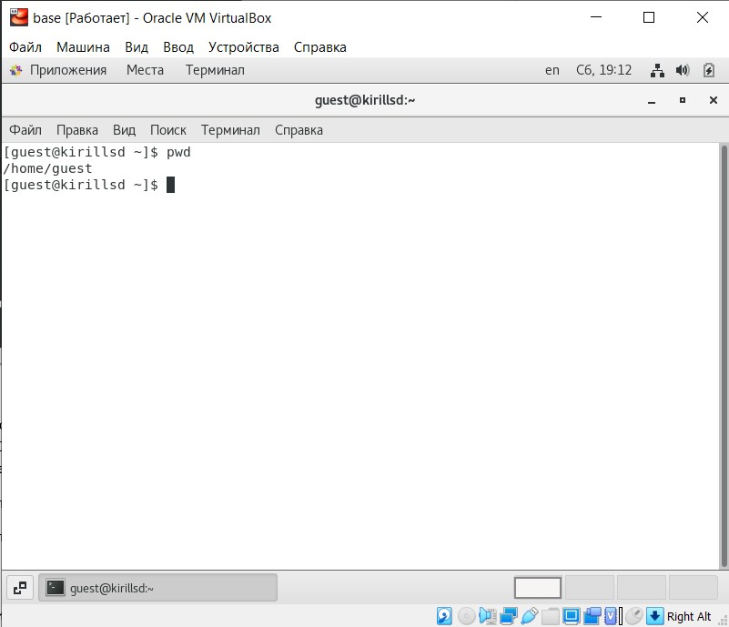
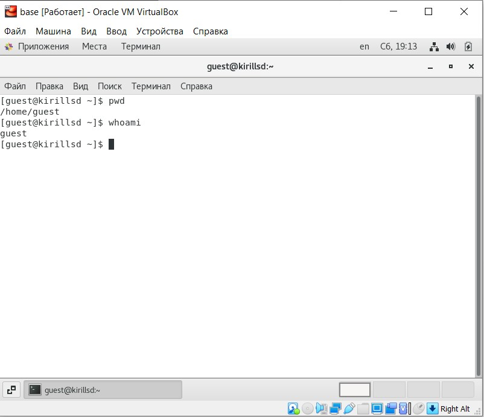
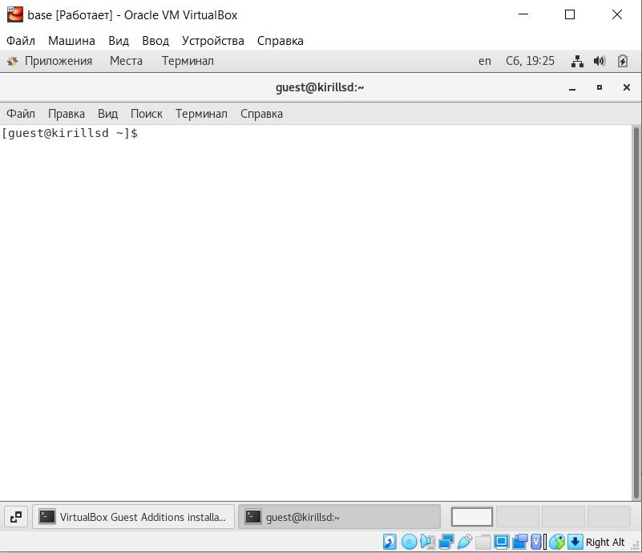
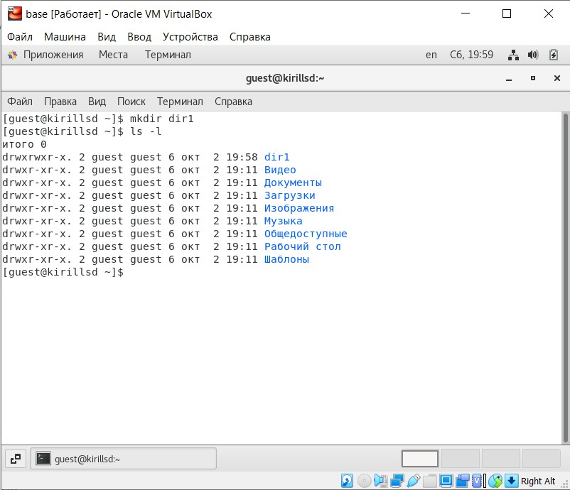
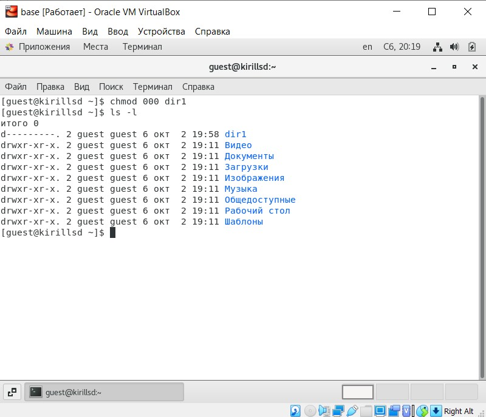

---
## Front matter
lang: ru-RU
title: Установка ОС на виртуальную машину
author: |
	 Сидоракин Кирилл Вячеславович НБИбд-01-18\inst{1}

institute: |
	\inst{1}Российский Университет Дружбы Народов

date: 02 октября, 2021, Москва, Россия

## Formatting
mainfont: PT Serif
romanfont: PT Serif
sansfont: PT Sans
monofont: PT Mono
toc: false
slide_level: 2
theme: metropolis
header-includes: 
 - \metroset{progressbar=frametitle,sectionpage=progressbar,numbering=fraction}
 - '\makeatletter'
 - '\beamer@ignorenonframefalse'
 - '\makeatother'
aspectratio: 43
section-titles: true

---
## Цель лабораторной работы

Получение практических навыков работы в консоли с атрибутами файлов, закрепление теоретических основ дискреционного разграничения доступа в современных системах с открытым кодом на базе ОС Linux.

# Процесс выполнения лабораторной работы

## Создаю учетную запись пользователя guest

{ #fig:001 width=70% }

## Задаю пароль для пользователя guest

{ #fig:002 width=70% }

## Вхожу в систему от имени guest

{ #fig:003 width=70% }

.jpg){ #fig:004 width=70% }

## Определяю директорию, в которой я нахожусь

{ #fig:005 width=70% }

## Уточняю имя пользователя

{ #fig:006 width=70% }

## Использую команду "id" и "group"
{ #fig:007 width=70% }

.jpg){ #fig:008 width=70% }

## Делаем сравнение

{ #fig:009 width=50% }

## Просматриваем файл "/etc/passwd/".

{ #fig:010 width=70% }

## Определяем существующие в системе дирректории

{ #fig:011 width=70% }

## Проверяем расширенные атрибуты

{ #fig:012 width=70% }

## Создаем поддиректорию dir1 в домашней директории

{ #fig:013 width=70% }

## Снимаем с директории dir1 все атрибуты

{ #fig:014 width=70% }

## Создаем в директории dir1 файл file1

{ #fig:015 width=70% }

## Проверка наличия файла

{ #fig:016 width=70% }

## Таблица прав на директорию

{ #fig:017 width=70% }

# Выводы по проделанной работе

## Вывод
Мы приобрели практические навыки работы в консоли с атрибутами файлов, закрепели теоретические основы дискреционного разграничения доступа в современных системах с открытым кодом на базе ОС Linux.