---
# Front matter
lang: ru-RU
title: "Отчёт по лабораторной работе №2"
subtitle: "Дискреционное разграничение прав в Linux. Основныеатрибуты"
author: "Сидоракин Кирилл Вячеславович НБИбд-01-18"

# Formatting
toc-title: "Содержание"
toc: true # Table of contents
toc_depth: 2
lof: true # List of figures
fontsize: 12pt
linestretch: 1.5
papersize: a4paper
documentclass: scrreprt
polyglossia-lang: russian
polyglossia-otherlangs: english
mainfont: PT Serif
romanfont: PT Serif
sansfont: PT Sans
monofont: PT Mono
mainfontoptions: Ligatures=TeX
romanfontoptions: Ligatures=TeX
sansfontoptions: Ligatures=TeX,Scale=MatchLowercase
monofontoptions: Scale=MatchLowercase
indent: true
pdf-engine: lualatex
header-includes:
  - \linepenalty=10 # the penalty added to the badness of each line within a paragraph (no associated penalty node) Increasing the value makes tex try to have fewer lines in the paragraph.
  - \interlinepenalty=0 # value of the penalty (node) added after each line of a paragraph.
  - \hyphenpenalty=50 # the penalty for line breaking at an automatically inserted hyphen
  - \exhyphenpenalty=50 # the penalty for line breaking at an explicit hyphen
  - \binoppenalty=700 # the penalty for breaking a line at a binary operator
  - \relpenalty=500 # the penalty for breaking a line at a relation
  - \clubpenalty=150 # extra penalty for breaking after first line of a paragraph
  - \widowpenalty=150 # extra penalty for breaking before last line of a paragraph
  - \displaywidowpenalty=50 # extra penalty for breaking before last line before a display math
  - \brokenpenalty=100 # extra penalty for page breaking after a hyphenated line
  - \predisplaypenalty=10000 # penalty for breaking before a display
  - \postdisplaypenalty=0 # penalty for breaking after a display
  - \floatingpenalty = 20000 # penalty for splitting an insertion (can only be split footnote in standard LaTeX)
  - \raggedbottom # or \flushbottom
  - \usepackage{float} # keep figures where there are in the text
  - \floatplacement{figure}{H} # keep figures where there are in the text
---

# Цель работы

Получение практических навыков работы в консоли с атрибутами файлов, закрепление теоретических основ дискреционного разграничения доступа в современных системах с открытым кодом на базе ОС Linux.

# Выполнение лабораторной работы

Создаю учетную запись пользователя guest

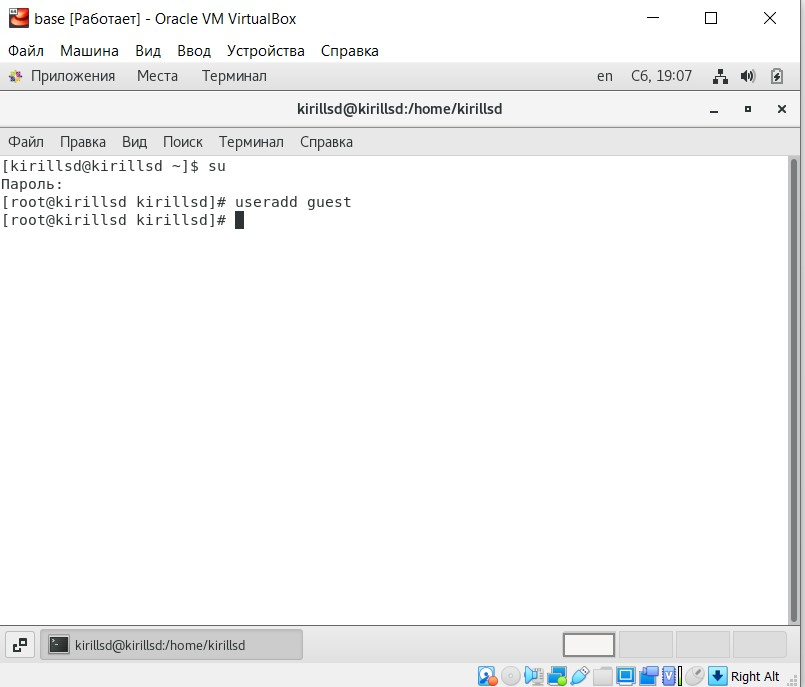{ #fig:001 width=70% }

Задаю пароль для пользователя guest

{ #fig:002 width=70% }

Вхожу в систему от имени guest

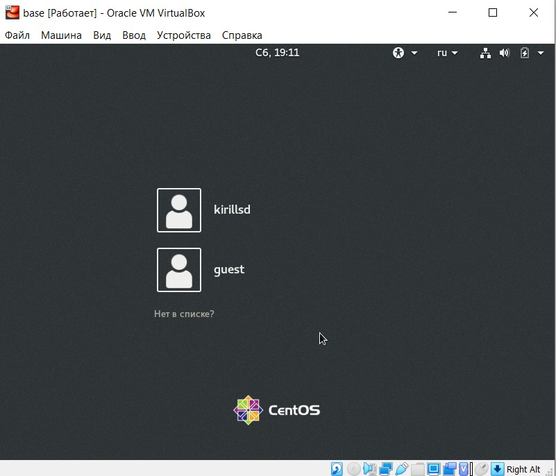{ #fig:003 width=70% }
.jpg){ #fig:004 width=70% }

Определяю директорию, в которой я нахожусь
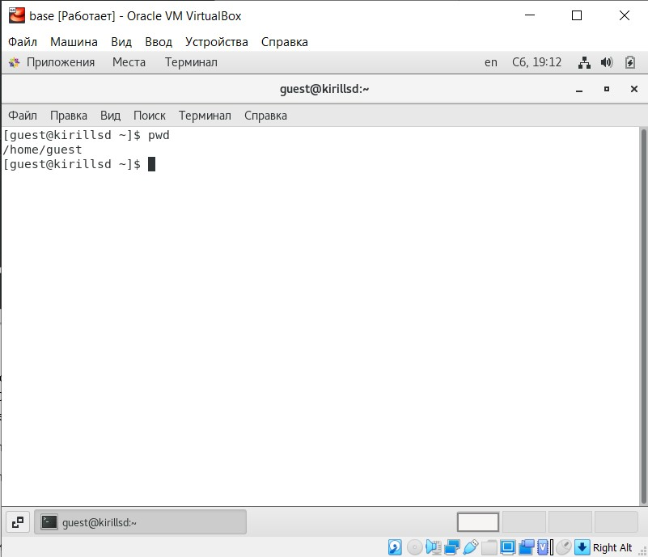{ #fig:005 width=70% }

Уточняю имя пользователя
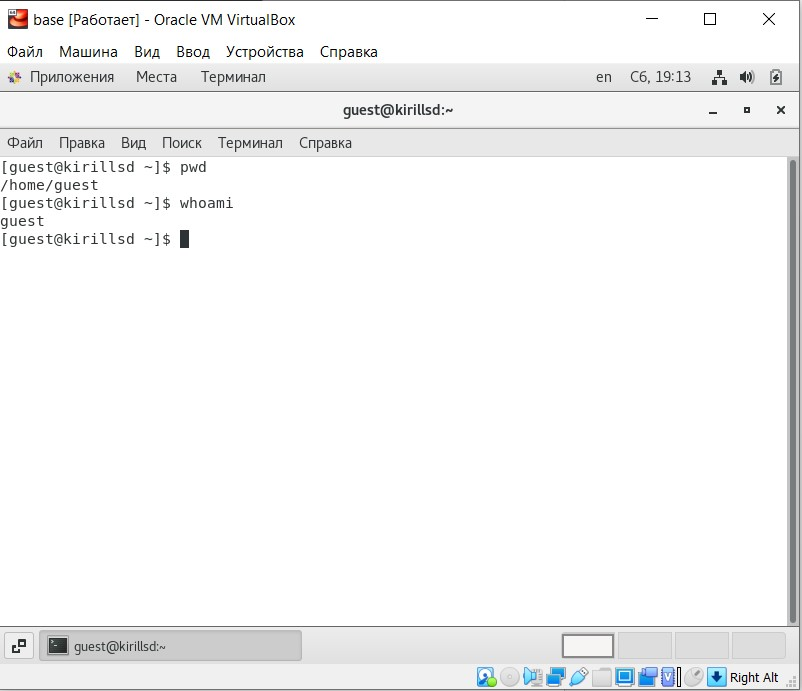{ #fig:006 width=70% }

Использую команду "id" и "group"
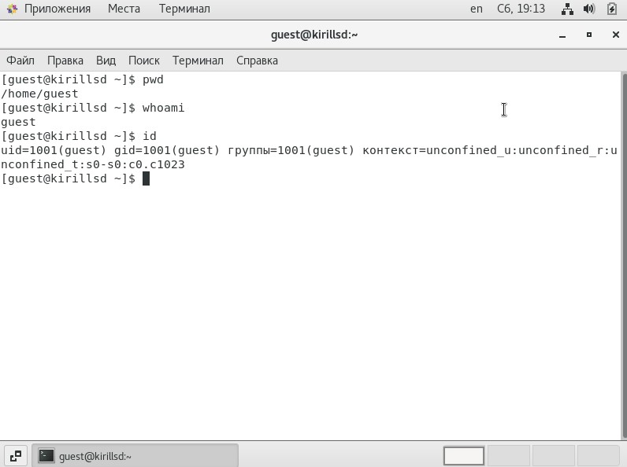{ #fig:007 width=70% }
.jpg){ #fig:008 width=70% }

Сравниваем полученную информацию об имени пользователя выводимыми в приглашении командной строки

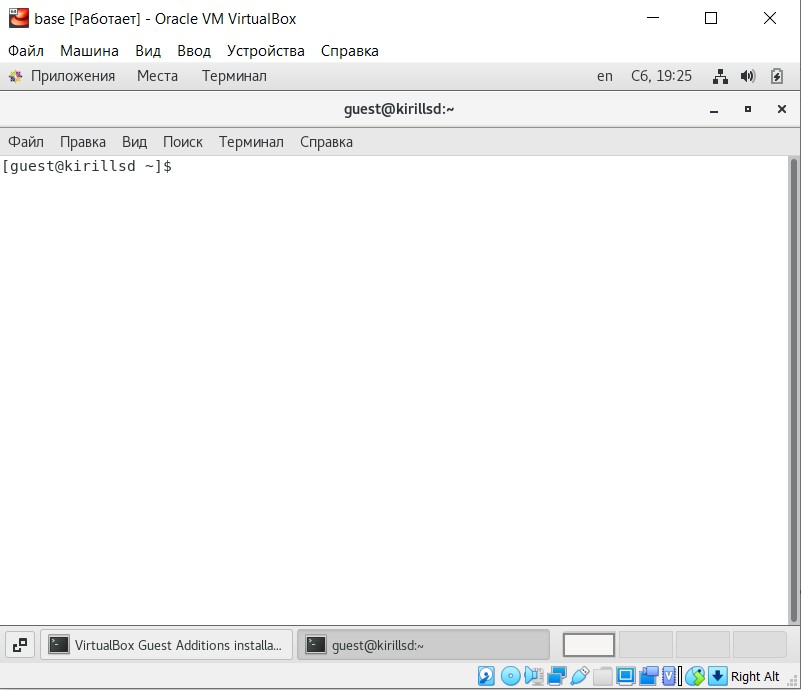{ #fig:009 width=70% }

Просматриваем файл "/etc/passwd/" и находим в нем нашу учетную запись, uid и gid пользователя.
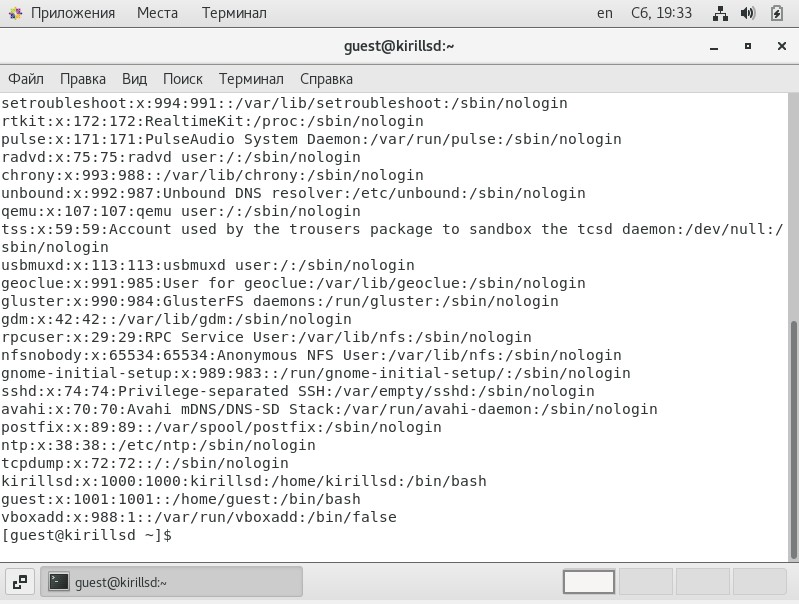{ #fig:010 width=70% }

guest: uid=1000, gid=1000
kirillsd: uid=1000, gid =1000

Определяем существующие в системе дирректории
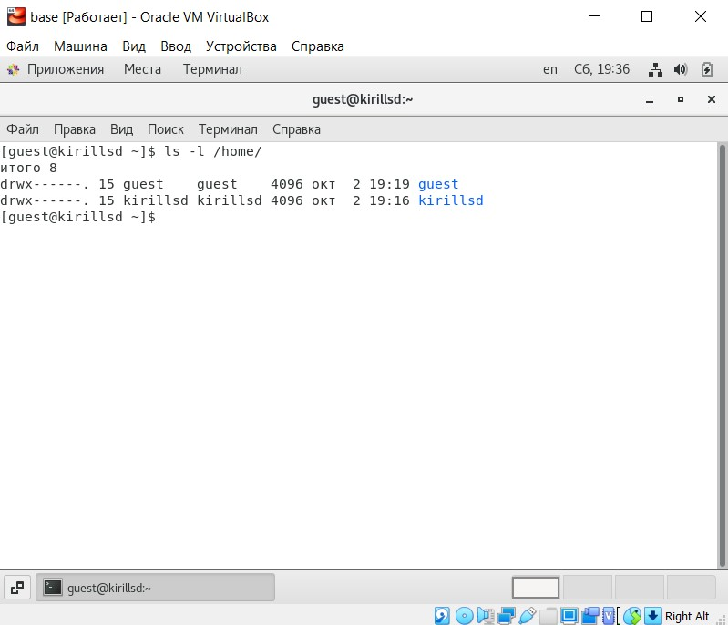{ #fig:011 width=70% }

Проверяем какие расширенные атрибуты установлены на поддиректориях
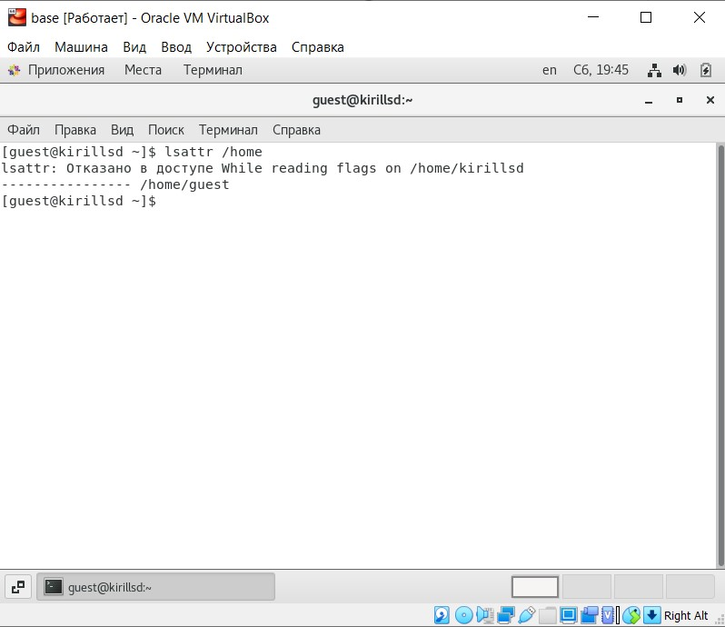{ #fig:012 width=70% }

Не удалось увидеть расширенные атрибуты. Так как нет доступа.

Создаем поддиректорию dir1 в домашней директории
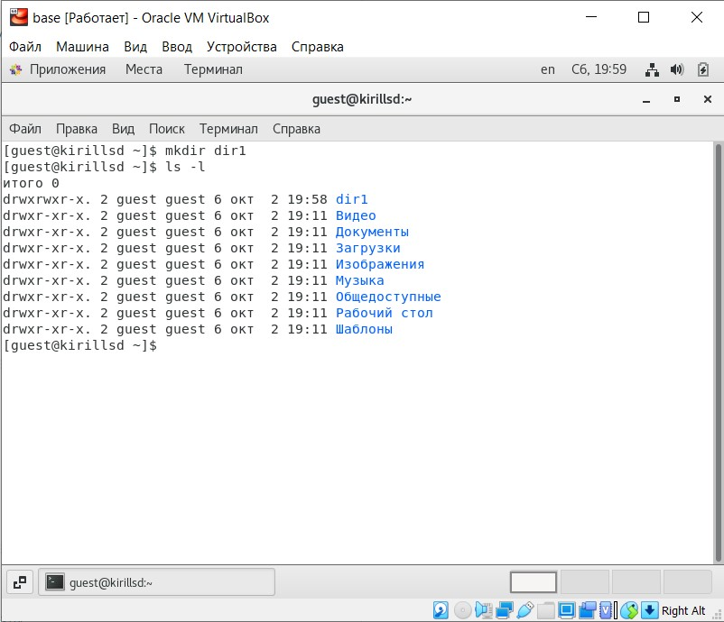{ #fig:013 width=70% }

Снимаем с директории dir1 все атрибуты
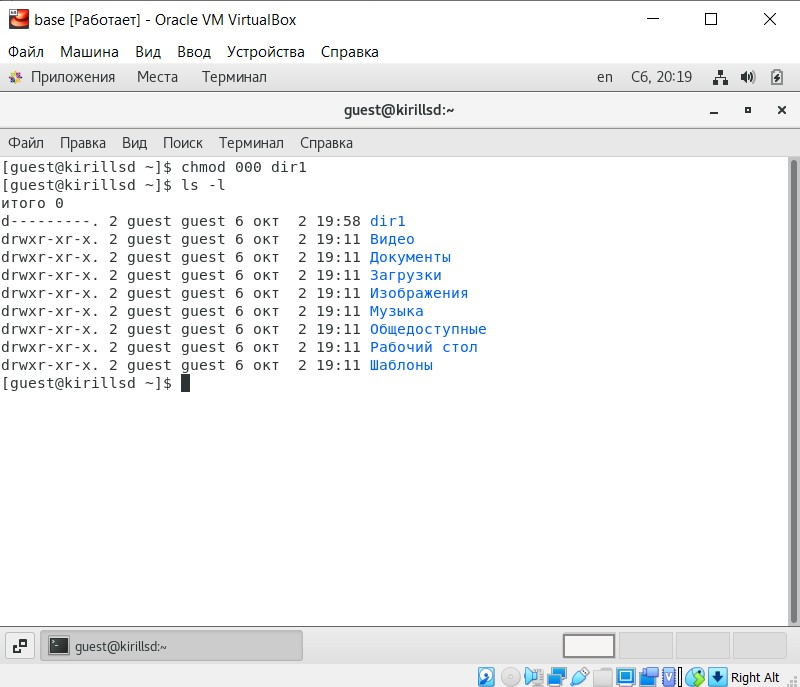{ #fig:014 width=70% }

Создаем в директории dir1 файл file1
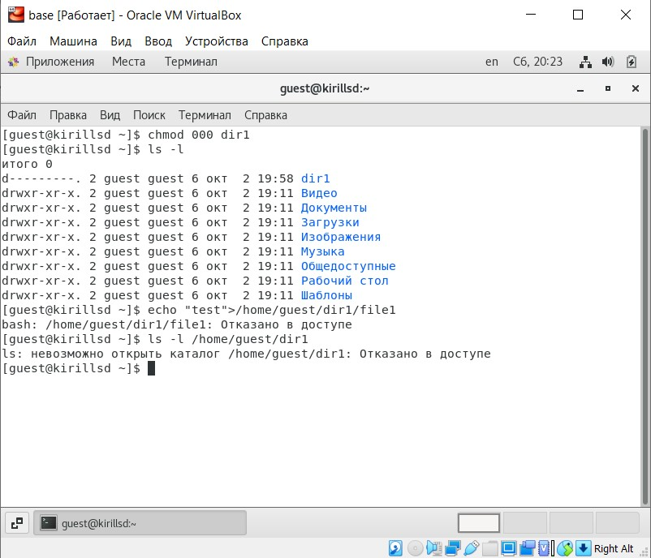{ #fig:015 width=70% }

Не получилось создать файл, так как отказано в доступе.(Нет прав)

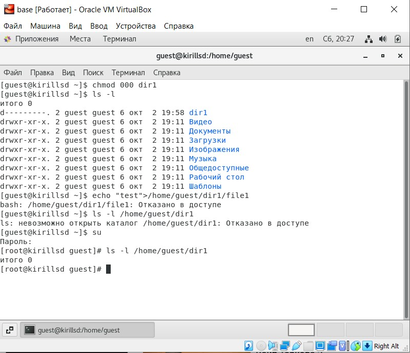{ #fig:016 width=70% }

Таблица прав на директорию

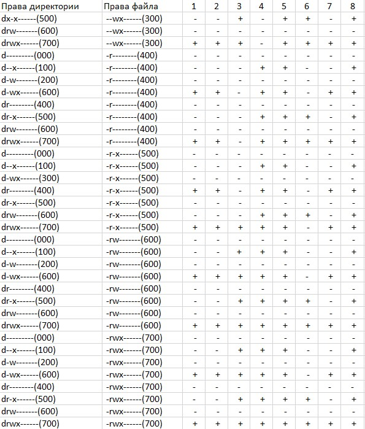{ #fig:017 width=70% }

# Вывод

Мы приобрели практические навыки работы в консоли с атрибутами файлов, закрепели теоретические основы дискреционного разграничения доступа в современных системах с открытым кодом на базе ОС Linux.